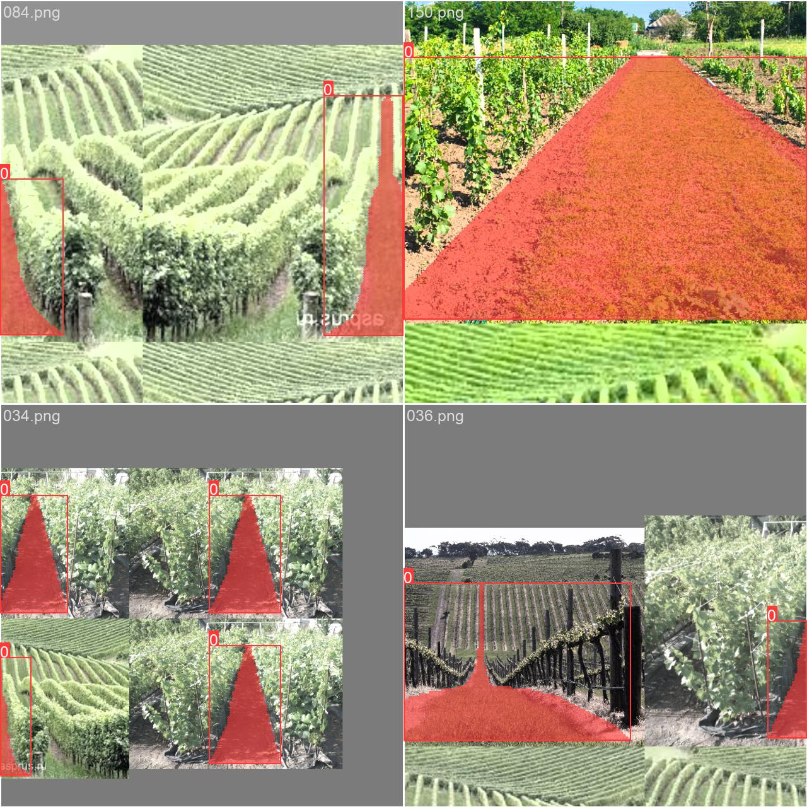
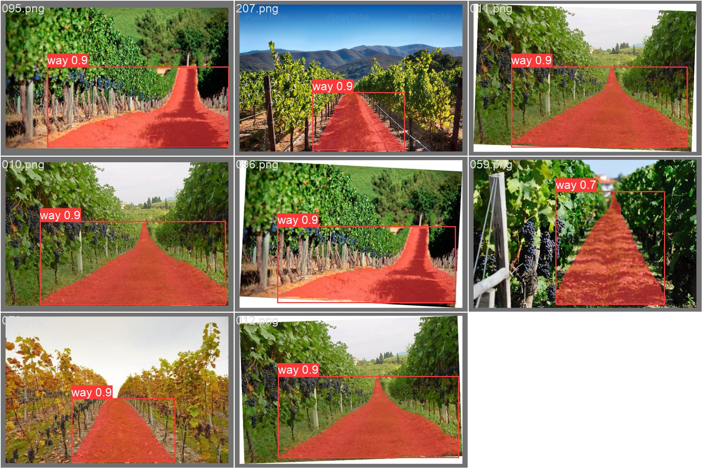

# YOLOv8-Segmentation-Agro-Inspector-Vineyard
# Neural network for a mobile robot inspector in a vineyard.
I have a small vineyard that requires a lot of time to examine its condition.
I know how to program a little :-)
Therefore, I decided to make myself an assistant - a small robot on a wheeled chassis. Perhaps there will be a copter.
The robot's main task is to analyze the condition of the vineyard.
It is necessary to recognize diseases in advance by the condition of the leaf.
This is very important in winemaking.
In addition, he must independently move within the rows using machine vision and obstacle recognition.
An attempt has been made to implement the code at minimal cost.
This repository provides a small example.
Work on the project is not completely finished.

Agrobot tasks:

Movement:
- detection and independent movement in the rows of the vineyard;
- detection of grape trunks - bushes;
- detection of pillars and supports;
- detection of the presence of humans and animals for security purposes;

Vineyard inspection:
- detection of grape diseases based on the condition of leaves;
- detecting vine growth and drawing up a pruning plan;

Work in the vineyard:
- independent movement along the rows and spraying;
- movement behind employees in the “follow me” mode;
- security functions;

------------------------------------------------
# Software environment for training the model - Ultralytics
https://github.com/ultralytics/ultralytics

Models trained: yolov8n-seg.pt, yolov8m-seg.pt, yolov8s-seg.pt

Model prediction results:
<html>
<body>

</body>
</html>

As an experiment, we did two options:
- training only in detecting the road between rows;
- training in detecting roads between rows, pillars, bushes...

